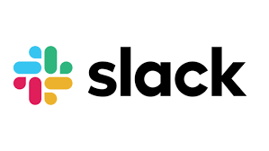

# Application Review

Application: Slack https://slack.com/

## Slack
Slack is a messaging app for business that connects people to the information they need. By bringing people together to work as one unified team, Slack transforms the way organizations communicate. It offers public and private channels, easy file sharing, and critical integrations with Zoom and Google Drive. Slack was the first application that came to my mind during the class discussion on connected applications. 

## Critique

### Pros?
1) Slack is a highly accessible application. It is important to underline the fact that Slack is not complicated. Whether you want to access Slack from your desktop, laptop, smartphone, or tablet, Slack can be easily accessed. 

2) There is a lot of customization available. You can alter how alerts function, from mudding channels that aren't essential to your work to completely enabling and removing notifications. You may even turn off all notifications at certain times of the day.

3) Within a Slack discussion, you can share files and documents with other users in real-time. There’s the ability to comment on a document and get feedback instantly, and files, documents, and photos are shareable from your desktop or cloud storage service. 

4) Once you successfully join an existing group, you have immediate access to previous chats. You may easily locate previous discussions to catch up on project development and discover what questions were posed. 

5) Slack integrates with several top applications, and more get added regularly. Integrations are available with Zoom, Google Drive, Asana, Monday.com, Dropbox, Outlook Calendar, and Zendesk.

### Possible Improvements
At first glance, to me it seemed like a glorified text messaging app that lets you share files. A second peek beneath the surface reveals a streamlined and powerful interface, one that would appeal to larger companies with high-end features and good security. 

However, improvements can still be made, as follows:

1) Slack’s video and audio calls could be more stable. Additionally, when calling others, there can be long delays before you can finally connect. 

2) Pricing!!!!!! Although Slack has a free plan, paid plans are not cheap compared to other services. However, as Slack is mainly business application, their pricing seems fair. They could potentially improve offerings for their free plan for small businesses and startups. 

