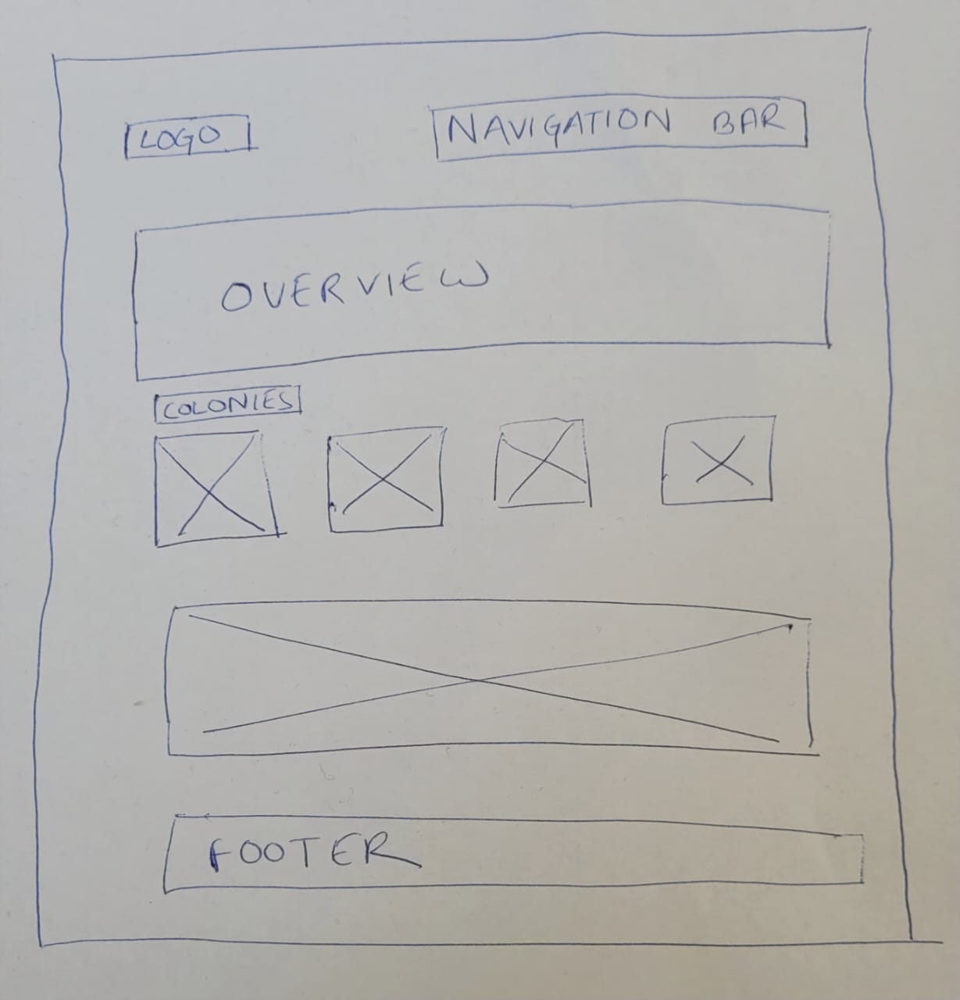
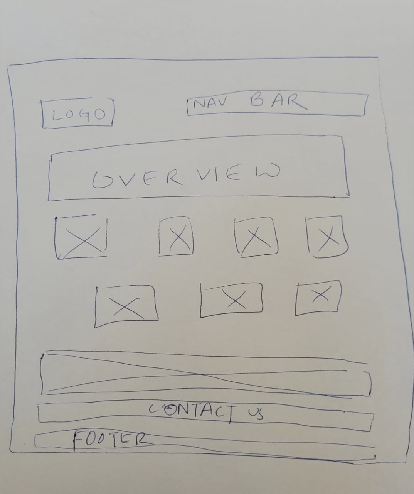

# Citation Portfolio Page 

**Title**: Catfolio : Campus Cats Page  
**Date**: 05 September 2022  
**Deliverable**: CSS/HTML Webpage  

For week 1, the assignment was to make a static website on our any previous project using html and CSS. However, I have made a website on NYUAD Campus Cats. The website contains photo gallery and information about all the cats living at NYUAD campus.

[Access Project Here](https://hasiburratul.github.io/connectionslab/Week_1/Assignment1/)

### WireFrame 

For the project I created two wireframes. Both were quite similar. 

Eventually I worked on the second wireframe. Details are as follows:

1. Header (Logo + Navigation Bar)
2. Section-1 (Overview with a background image)
3. Section-2 (Cats' Photo Gallery with Information)
4. Section-3 (Video)
5. Section-4 (Contact Information)
5. Footer

---

### Process & Insights

I started with the header. On the right, there is my logo, also a link to the "homepage". Although it is a single page website, I added navigation bar with the list of links to multiple pages. On hover, the logo reduces it's opacity and the link texts change color. This was added to give more feedback to the users.  

For the font sizes, I used vw to keep my design consistent on all browsers and make it responsive to different devices.  

For the section-2-overview making a 4-box-grid-system was challenging. I leanrt how to use **grid-template-columns** and **grid-template-rows** to adjust the grid template. I still need to improve my skills on grid system. I want to learn how to make customized grid with various cell sizes.  

For the content part (background, UX design, Playtesting ...), I downloaded portfolio I created on figma and uploaded to the website as images. This way, I could display more customized design and add graphs easily.  

---

### Page Screenshot

