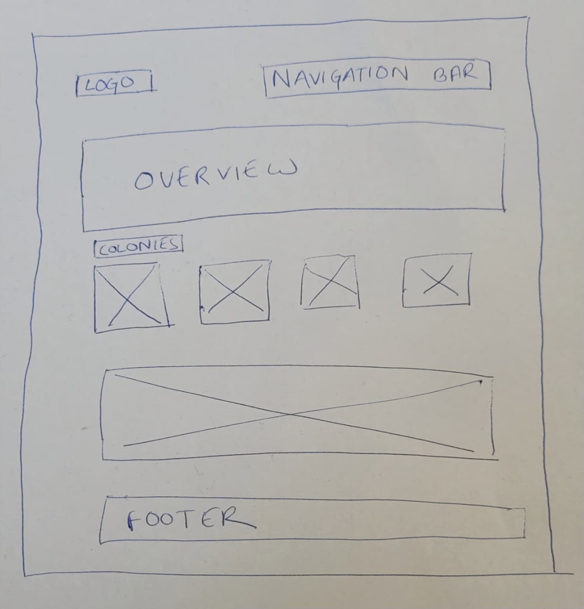
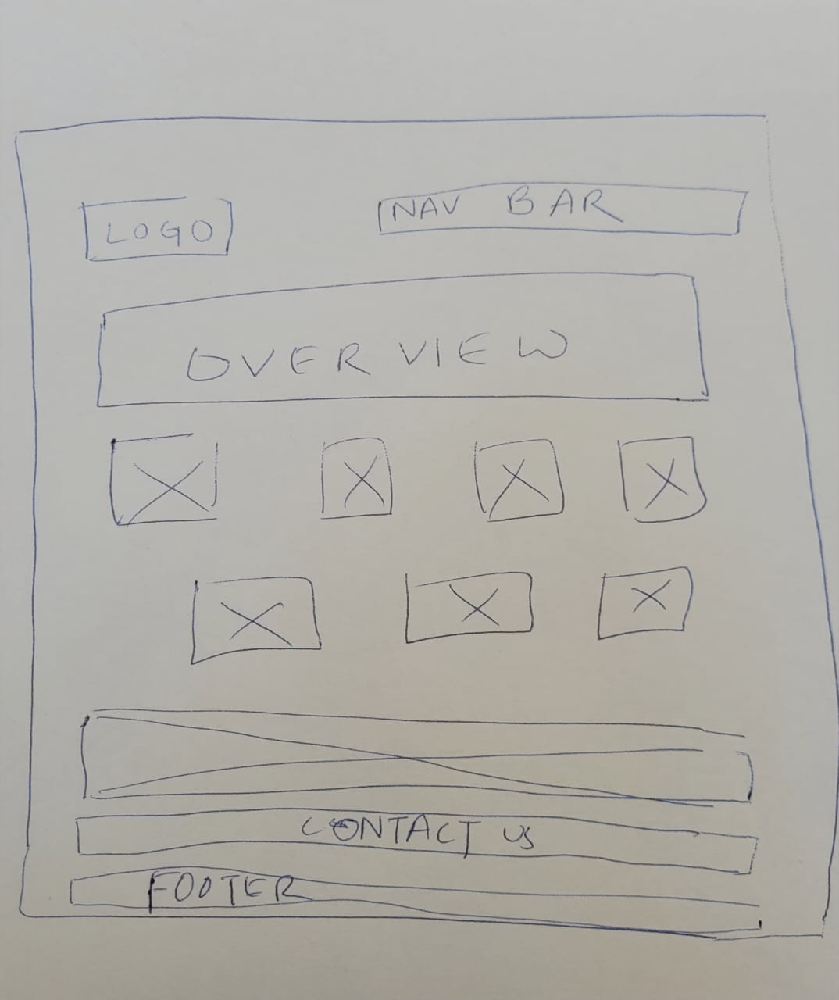
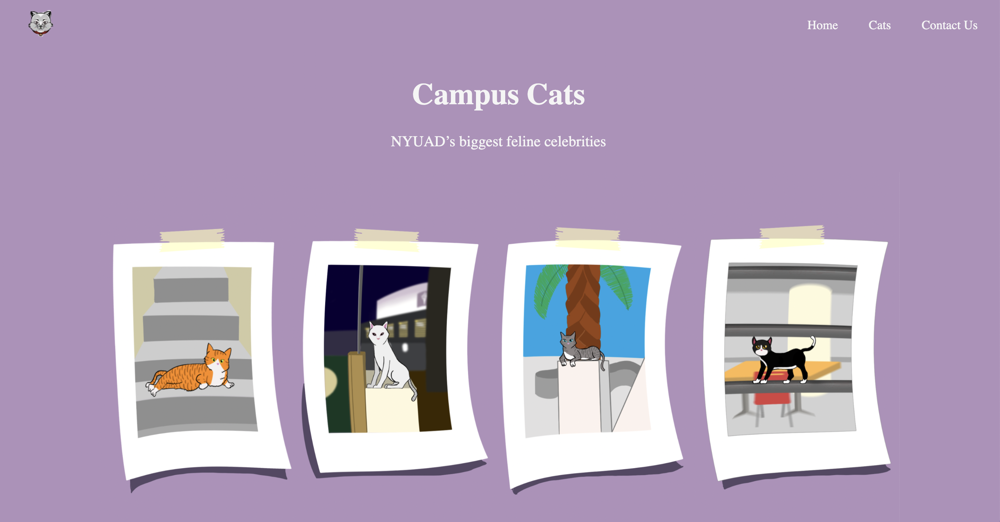
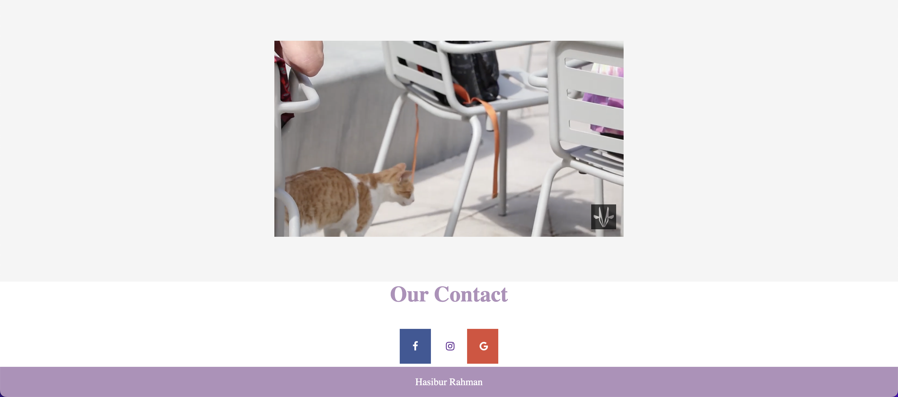

# Catfolio: Campus Cats Page 

**Title**: Catfolio : Campus Cats Page  
**Date**: 05 September 2022  
**Deliverable**: CSS/HTML Webpage  

For week 1, the assignment was to make a static website on our any previous project using html and CSS. However, I have made a website on NYUAD Campus Cats. The website contains photo gallery and information about all the cats living at NYUAD campus.

[Access Project Here](https://hasiburratul.github.io/connectionslab/Week_1/Assignment1/)

### WireFrame 

For the project I created two wireframes. Both were quite similar. 

Eventually I worked on the second wireframe. Details are as follows:

1. Header (Logo + Navigation Bar)
2. Section-1 (Overview with a background image)
3. Section-2 (Cats' Photo Gallery with Information)
4. Section-3 (Video)
5. Section-4 (Contact Information)
5. Footer

---

### Process & Insights

After preparing my wireframe, I started developing the page only with html.  You can acccess the directly translated html file here [Webpage-HTML](https://hasiburratul.github.io/connectionslab/Week_1/catfoliowireframe).  

The navigation bar directs to different sections of the website, as this a single page website. The logo also works as a link to the top section (Home). Both the navigation bar and logo change their opacity and color while hovering on them. I have used both the vw and px format. I have added the vw later to make the website responsive.  

In the section 1, with the help of css I have just displayed basic info on top of a background image.  

For the section 2, learning the css was extremely difficult for me. To align the image I have relied on Flex. To learn image overlay effects I took help from W3 schools. I have also added another background image in this section.  

The section 3 only contains an embedded youtube video. The video has muted autoplay upon scrolling over it.  

In the section 4, I have added social media buttons with help from W3 schools.  

In the footer, I have again used the flex and displayed basic information.

---

### Page Screenshot

