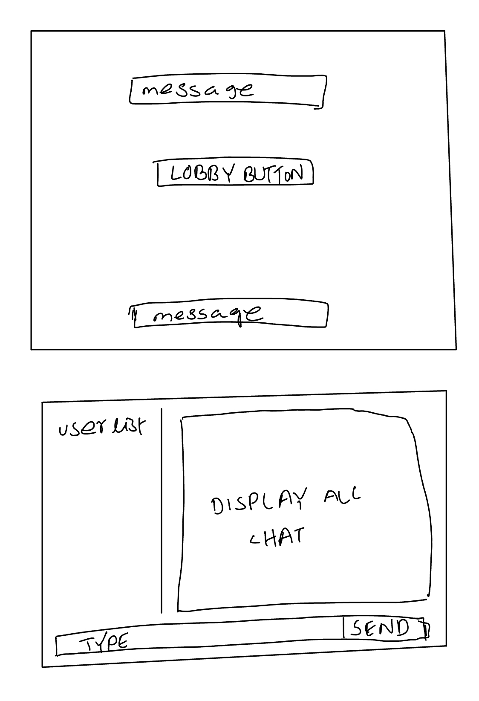

# Explore NYUAD

**Title**:90's Tank Game <br>
**Category**: Project 2 <br>
**Date**: 10 November <br>
**Deliverable**: CSS | HTML | Javascript | Socket. IO | express | node.js <br>


[Access Project Here](https://tank-game-socket.herokuapp.com/)

### Project Brief 

This game is inspired by the classic tank game of 90's. On the landing page, players are requested to join the lobby with their username. In this game, players can chat with other players and challenge them for one round of the game. On the landing page, players are requested to join the lobby with their username. If one player accept other player's challenge then both players will be taken to the game page an game will start immediately. If one player disconnects from the game during the game, other player will get a notification and return to the main lobby. After one round ot the game, one can request for a rematch or return to the main lobby. 

### Wire Frame

For the game I started the project with two wireframe. I made one wireframe for the landing page and one canvas for the game play itself<br> <br>



<br> <br>

 <br> <br>

### Game Development 

### Challenges

The toughest part of this project was to understand the game mechanics. It was really challenging to translate the physics of a tank into the game. I had to divide a tank movement into two parts: movement of the tnak and movement of the turret of the tank. To better understand the game mechanics I started with the workflow and translated the game part by part. To make the game realtime I made the socket enmit data as small as possible. The codes are shared with the workflow for better understanding.

### Workflow

* <b> Initialize the server </b>
* <b> New user click on the enter to the lobby to connect to socket.io</b>
* <b> New users connect to socket.io </b>
* <b> New users are added to the lobby & global chat box </b>

```
   // Lobby
  client.on("get users", function (data) {
    client.emit("get users", usernames);
  });

  client.on("send message", function (data) {
    client.broadcast.emit("send message", data);
    client.emit("send message", data);
  });

  client.on("welcome message", function (data) {
    client.emit("welcome message", data);
  });

  client.on("add user", function (username) {
    // add the clients username to the global list of users
    let userObj = {};
    userObj.name = username;
    userObj.id = client.id;
    userObj.ingame = false;
    usernames.push(userObj);
    addedUser = true;
    client.broadcast.emit("user joined", usernames);
    client.emit("user joined", usernames);
  });

```

* <b> Users challenging each other and accepting challenge </b>

```
  client.on("send challenge", function (data) {
    enemyid = data.enemy;
    playerid = data.player;
    client.broadcast.to(enemyid).emit("send challenge", data);
  });
```

* <b> After the game track user data and emit to the opponent </b>

```
// Game
  client.on("commence game", function (data) {
    inGame = true;
    client.broadcast.to(data.enemy).emit("commence game", data);
    let newData = {
      player: data.enemy,
      playerColor: data.enemyColor,
      enemy: data.player,
      enemyColor: data.playerColor,
    };
    client.emit("commence game", newData);
  });

  client.on("change game state", function (playerID, state) {
    for (let i = 0; i < usernames.length; i++) {
      if (usernames[i].id === playerID) {
        usernames[i].ingame = state;
        client.emit("change game state", playerID, state);
      }
    }
    client.broadcast.emit("user joined", usernames);
    client.emit("user joined", usernames);
  });

  client.on("canvasUpdate", function (data) {
    client.broadcast.to(data.enemy).emit("canvasUpdate", data);
  });

```

* <b> Update user's damage based on the opponent's action </b>
  

```
   client.on("takeDamage", function (data) {
    client.broadcast.to(data.enemy).emit("takeDamage", data);
  });
  ```

* <b> Update users' health based on the opponent's action </b>
  

```
  client.on("updateBullets", function (data) {
    client.broadcast.to(data.enemy).emit("updateBullets", data);
  });
  ```

* <b> If user's health is zero update the opponent </b>

```
  client.on("iLost", function (data) {
    client.broadcast.to(data.enemy).emit("iLost", data);
  });

```

* <b> Emit user's rematch request</b>
  

```
 client.on("rematch", function (data) {
    client.broadcast.to(data.enemy).emit("rematch", data);
  });

  ```

 
* <b> Update the opponent if user leaves the game </b>

```
  client.on("iLeft", function (data) {

    inGame = false;
    client.broadcast.to(data.enemy).emit("iLeft", data);

  }); 
```

* <b> Update user list if any user disconnects </b>

```

  // When client's socket disconnects, remove user from
  // array of usernames, and broadcast updated usernames
  client.on("disconnect", function () {

    let otherPlayer;
    // these letiables are misnomers: for one player, player id is himself, but
    // for the other player, player id is the enemy.
    if (enemyid === client.id) otherPlayer = playerid;
    else otherPlayer = enemyid;
    if (inGame) {
      client.broadcast
        .to(otherPlayer)
        .emit("iLeft", { player: client.id, disconnected: true });
    }
    if (addedUser) {
      usernames.forEach(function (object) {
        if (object.id === client.id) {
          usernames.splice(usernames.indexOf(object), 1);
        }
      });
    }
    client.broadcast.emit("user joined", usernames);
    enemyid = null;
    inGame = false;

  }); 

```

### Game Canvas

<b> The game's main canvas or map contains walls and the two tanks. The elements were drawn using canvas api.</b>

<b> The function to draw the walls </b>

```
function makeWalls() {
  let wallAnchors = [];
  makeWallLengths(0.2,0.4,'vertical',0.2);
  makeWallLengths(0.2,0.4,'vertical',0.8);
  makeWallLengths(0.6,0.8,'vertical',0.2);
  makeWallLengths(0.6,0.8,'vertical',0.8);

  makeWallLengths(0.2,0.4,'horizontal',0.2);
  makeWallLengths(0.2,0.4,'horizontal',0.8);
  makeWallLengths(0.6,0.8,'horizontal',0.2);
  makeWallLengths(0.6,0.8,'horizontal',0.8);

  let centerWall = new Wall(canvas.width/2 - 20, canvas.height/2 - 20, 40, 40);
  walls.push(centerWall);

  // axisFract is the x or y to draw the line along, in fraction of the total canvas width/height
  // it is assumed to be the axis that 'orientation' is not
  function makeWallLengths(start,end,orientation,axisFract) {
    let full;
    let axis;
    let coords;
    if (orientation === 'vertical') {
      full = canvas.height;
      axis = canvas.width*axisFract;
      coords = ['y','x'];
    }
    else {
      full = canvas.width;
      axis = canvas.height*axisFract;
      coords = ['x','y'];
    }
    for (let i = full*start; i <= full*end; i+=10) {
      let anchorCoords = {};
      anchorCoords[coords[0]] = i;
      anchorCoords[coords[1]] = axis;
      wallAnchors.push(anchorCoords);
    }
  }

  for (let i = 0; i < wallAnchors.length; i++) {
    let wall = new Wall(wallAnchors[i].x, wallAnchors[i].y, 10, 10);
    walls.push(wall);
  }
}

function drawWalls() {
  for (let i = 0; i < walls.length; i++) {
    ctx.save();
    ctx.translate(walls[i].anchor.x, walls[i].anchor.y);
    ctx.fillStyle = 'lime';
    ctx.fillRect(0,0,walls[i].width,walls[i].height);
    ctx.restore();
  }
}
```

<b> The functions to draw the tank elements </b>

```
// Draws the tank
function drawTank(tank) {
  ctx.save();
  ctx.translate(tank.coordinates.x,tank.coordinates.y);
  ctx.rotate(tank.angle);
  var fillPercent = tank.health/100;
  var emptyWidth = tank.dimensions.width - fillPercent*tank.dimensions.width;
  var fullWidth = fillPercent*tank.dimensions.width;
  ctx.fillStyle = tank.color.main;
  ctx.strokeStyle = tank.color.main;
  // Draws an empty rectangle whose height indicates missing health
  ctx.strokeRect(tank.dimensions.width*(-0.5), tank.dimensions.height*(-0.5), emptyWidth, tank.dimensions.height);
  // Draws a full rectangle whose height indicates remaining health
  ctx.fillRect(tank.dimensions.width*(-0.5) + emptyWidth, tank.dimensions.height*(-0.5), fullWidth, tank.dimensions.height);
  drawArrow(tank);
  ctx.restore();
}

// Draws an arrow on the tank indicating the front of the tank
function drawArrow(tank) {
  ctx.beginPath();
  ctx.translate(0,0);
  ctx.moveTo(-13,0);
  ctx.lineTo(-5,-6);
  ctx.lineTo(-5,6);
  ctx.closePath();
  ctx.fillStyle = tank.color.extra;
  ctx.fill();
}

// Draws bullets
function drawBullets(bulletArray,color) {
  bulletArray.forEach(function(bullet) {
    ctx.beginPath();
    ctx.arc(bullet.coordinates.x, bullet.coordinates.y, 5, 0, 2*Math.PI, false);
    ctx.closePath();
    ctx.fillStyle = color;
    ctx.fill();
  });

```

### Tank's Physics

<b> I tried immitate the real life tank's physics in the game. Hence, tank's movement aren't smooth enough. The turret of the tank also has different movement requirements than the tank itself as like the real life tank. The tank also has a fixed health prior to the start of the game. The tank also has acceleration and deceleration besides their normal movement.

```
let Tank = function(nickname, color, coordinates, angle) {
    this.player = nickname;
    this.color = color;
  
    this.coordinates = coordinates;
    this.dimensions = {width: 30, height: 30};
  
    this.velocity = 0;
    this.maxForwardVelocity = 3;
    this.maxBackwardsVelocity = -0.8;
    this.forwardAccel = 0.04;
    this.backwardsAccel = 0.08;
    this.decel = 0.03;
    this.angle = angle + 90*Math.PI/180;
    this.turretAngle = angle;
  
    this.upPressed = false;
    this.rightPressed = false;
    this.downPressed = false;
    this.leftPressed = false;
  
    this.health = 100;
    this.gameOver = 0;
  };

```

### In Game Mechanics

For the game play the enemy tank's properties were updated from the information received from the enemy. During the gameplay, it was continuously checked if the tank was collided with the walls. If the bullets were hitting the user then the user's tank health was decreased by the amount of five. Bullet collisions were matched by the matching the coordinates of the tank's movment and bullet's movement. When the health reaches zero then the win/lose message was sent to the opponent.

### In Game Socket Events

<b> Updates the canvas based on information received from enemy player </b>

```
socket.on('canvasUpdate', function(data) {
	receiveUpdate(enemyTank, data.attributes);
});
```

<br> Updates the bullets based on information received from enemy player </b>

```
socket.on('updateBullets', function(data) {
	enemyBullets = data.bullets;
});
```

<b> Reduces health when enemy sends info that it hit you <b>

```
socket.on('takeDamage', function(data) {
	myTank.health -= data.damage;
});
```

<b> When the enemy's health hits zero you win <b>
socket.on('iLost', function(data) {

	myTank.gameOver = 1;
	dieCenter = data.dieCenter;
	explosionColor = data.color.explosion;

}); 

### Lobby Socket Events

<b> Lobby chat welcome message </b>

```
socket.on('welcome message', function(data) {
	let chatmessages = $('.chatmessagescontainer');
	let message = $('<p>').addClass('message').attr('id', 'welcome-message').text(data);
	chatmessages.append(message);
});
```

<b> Gets users that are connected when you first join </b>

```
socket.on('get users', addUser);
```

<b> Updates users when a user joins </b>

```
socket.on('user joined', addUser);

function addUser(users) {
	let usersDiv = $('.current-users');
	usersDiv.empty();
	if (users.length > 0) {
		users.forEach(function(userObj) {
			let user = $('<div>').addClass('username-div');
			let usernamePar = $('<p>').addClass('username-text').text(userObj['name']);
			if (userObj.name.length > 10) {
				usernamePar.css('font-size','20px').css('line-height','.75');
			}
			user.append(usernamePar);
			user.attr('socketID', userObj['id']);
			usersDiv.append(user);
			if (userObj.name !== username && !userObj.ingame) {
				user.append($('<div>').addClass('challenge-button user-button').text('Battle'));
			}
			else if (userObj.name !== username && userObj.ingame) {
				user.append($('<div>').addClass('ingame-button user-button').text('In Game'));
			}
		});
	}
}
```

<b> Receives a message and displays it </b>

```
socket.on('send message', function(data) {
	let chatmessages = $('.chatmessagescontainer');
	let messageTag = $('<p>').addClass('message').text(data.message);
	let userTag = $('<span>').addClass('username').text(data.name + ": ");
	messageTag.prepend(userTag);
	chatmessages.append(messageTag);
	chatmessages[0].scrollTop = chatmessages[0].scrollHeight;
});
```

<b> Receiving a challenge </b>

```
socket.on('send challenge', function(data) {
	let message = $('<p>').addClass('message').addClass('challenge-message challenge-message-button').text(data.name + ' has challenged you! Click here to accept.').attr('invitation-id',data.player);
	$('.chatmessagescontainer').append(message);
});
```

<b> Starts a game between two people </b>

```
socket.on('commence game', function(players) {

	$('.challenge-message').remove();
	socket.emit('change game state', players.player, true);
	$('canvas').show();
	$('#main-title').hide();
	$('#splashpage').hide();
	$('#lobby').hide();
	$('#end').remove();
	startGame(players.enemy, players.enemyColor, players.player, players.playerColor);

}); 

socket.on('change game state', function(playerID) {

	let users = $('.username-div');
	for (let i = 0; i < users.length; i++) {
		if (users.eq(i).attr('socketid') === playerID) {
			users.eq(i).find('.challenge-button').attr('class','ingame-button user-button').text('In Game');
		}
	}

}); 
```

### Play-Testing and Feedbacks

Due to time limitations I didn't do any play-testing before completing the whole game mechanics. I used 90's generation people on campus first for the play test. From the first group of players my expectations were feedback regarding the game machanics and game flow. In the second and third round of the playtesting targeted audience were gamers on campus. During the second and third round my aim was to take feedback regarding the UI and UX. But as till 3rd round I didn't play tested with any non-gamer and Gen-Z players there was mixed review during the final round of the playtesting from mostly Gen-Z non-gamer players. Most of them actually missed readind the instruction and struggled during their first attempt to play.

However, as the aim of the project was to recreate a 90's version of the tank game, I decided not change the retro look of the tank game. 

**Future Improvements:**

During the last round of the playtesting I received lots of request for a 2 vs 2/ 4 vs 4 round of the game. In future I am planning to include those requests. And there are few bugs in the game when the tank directly moves towards the wall in the beginning of the game. I want to remove those bugs.

### Reflection & Next Step

**Reflection**

I really enjoyed working on this. I regret not working in a group for the project. However, I got plenty of help from my rubber duck during coding the game. Before starting the work the whole project felt really simple. However, as soon as I started making the small blocks of code I realized how complex the game was. Without any game engine, buidling every single element from the bottom up was really difficult. I never thought the hardest part of the game would be determining the bullets movement path. I am now extremely proud of the curving bullet movement path. It was great working with sockets. I am very proud of completion of the project. Although I completed the game, I made mistake starting wiht the ideation of the game. Replicating something from 90's isn't always mean it would be easy to do.
From the project I got a realization that something very simple from outside can be very complicated in practice.
After I finished the project, I just felt massive respect for the last centuries game developers, who coded so many massive games without any game engine. 
