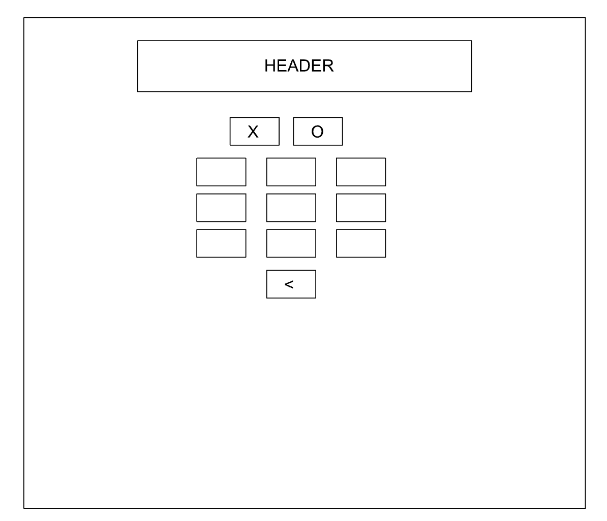
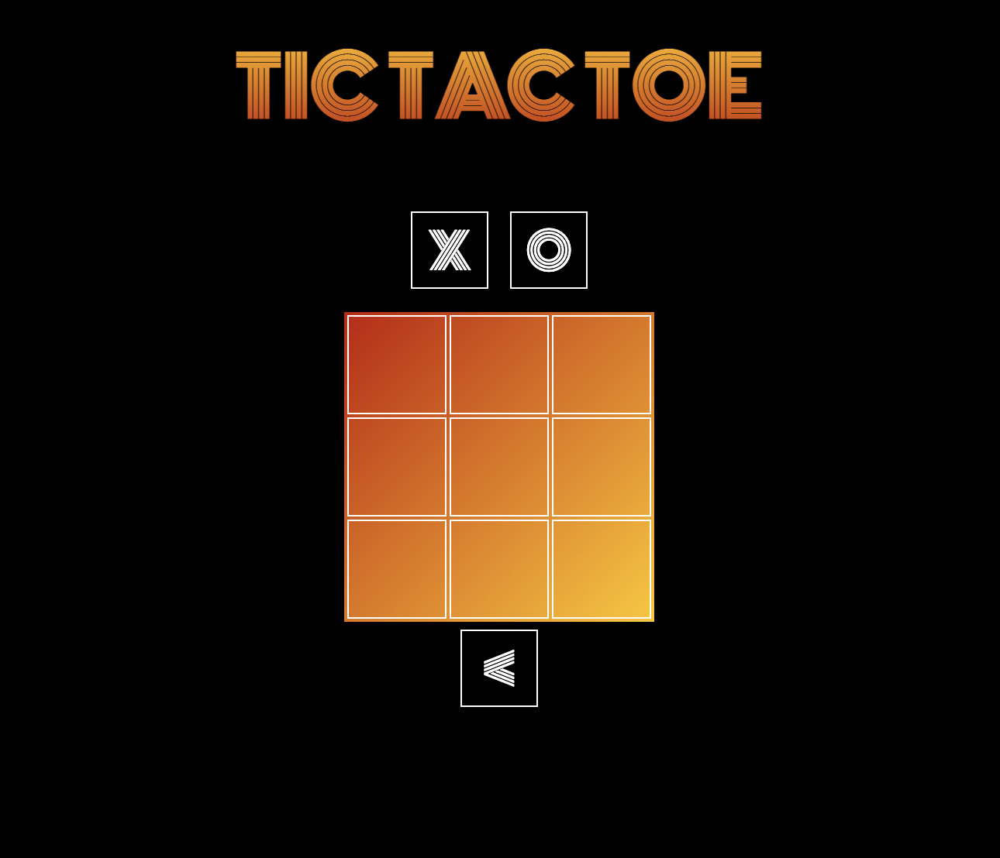
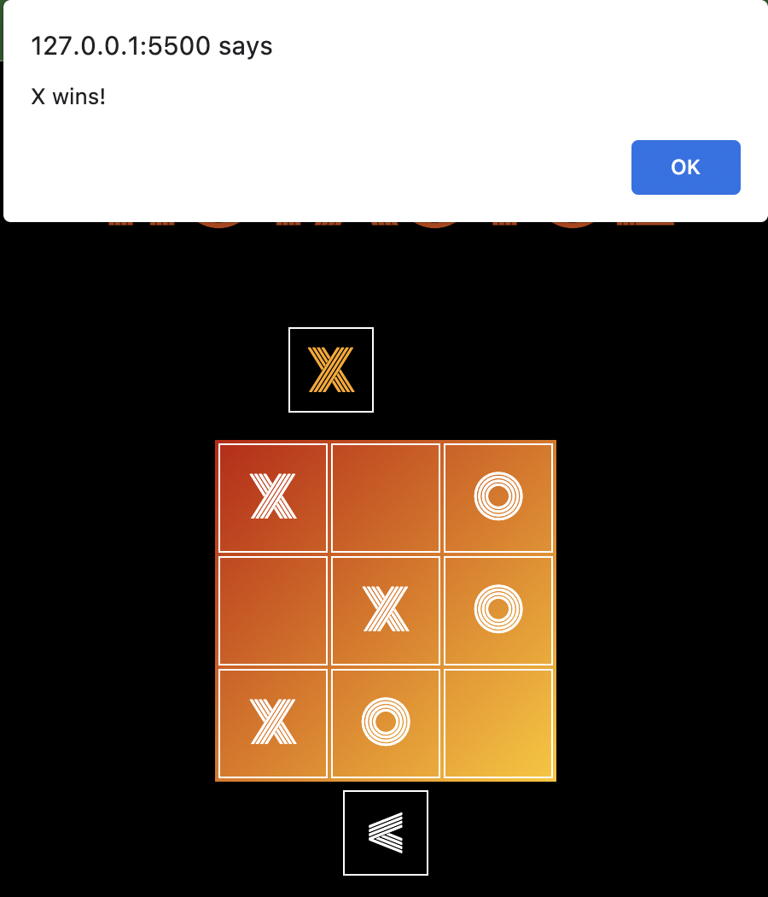

# TIC TAC TOE

**Title**: Tic Tac Toe  
**Date**: 12 September 2022  
**Deliverable**: CSS/HTML/JS Webpage  

For week 2, the assignment was to make a website using HTML, CSS, and Javascript. I have made a Tic Tac Toe Game using javascript. There's only one mode in the game i.e. Player vs Computer.

[Access Project Here](https://hasiburratul.github.io/connectionslab/Week_2/Assignment2/)

### WireFrame 

For the project I created one wireframe.

---

### Process & Insights

After preparing the wireframe, it seemed really simple to recreate.   

I translated the wireframe using the table tags of html. With the help of CSS, have custom styled every component of the webpage.  

The real problem for this game was to develop the javascript codes. Using the buttons I have taken user inputs at the start of the game, if O is chosen the computer moves first. After chosing the X or O, the other button despairs. I have disabled the X and O buttons after they are clicked to start the game. I have generated a random computer move in an empty square and disables that square. After every turn I have checked if the combination matches or not to win the game. If combination matches, the board automatically resets.  

To understand the logic of the game I have used Geeks4Geeks website. https://www.geeksforgeeks.org/simple-tic-tac-toe-game-using-javascript/

---

### Page Screenshot

