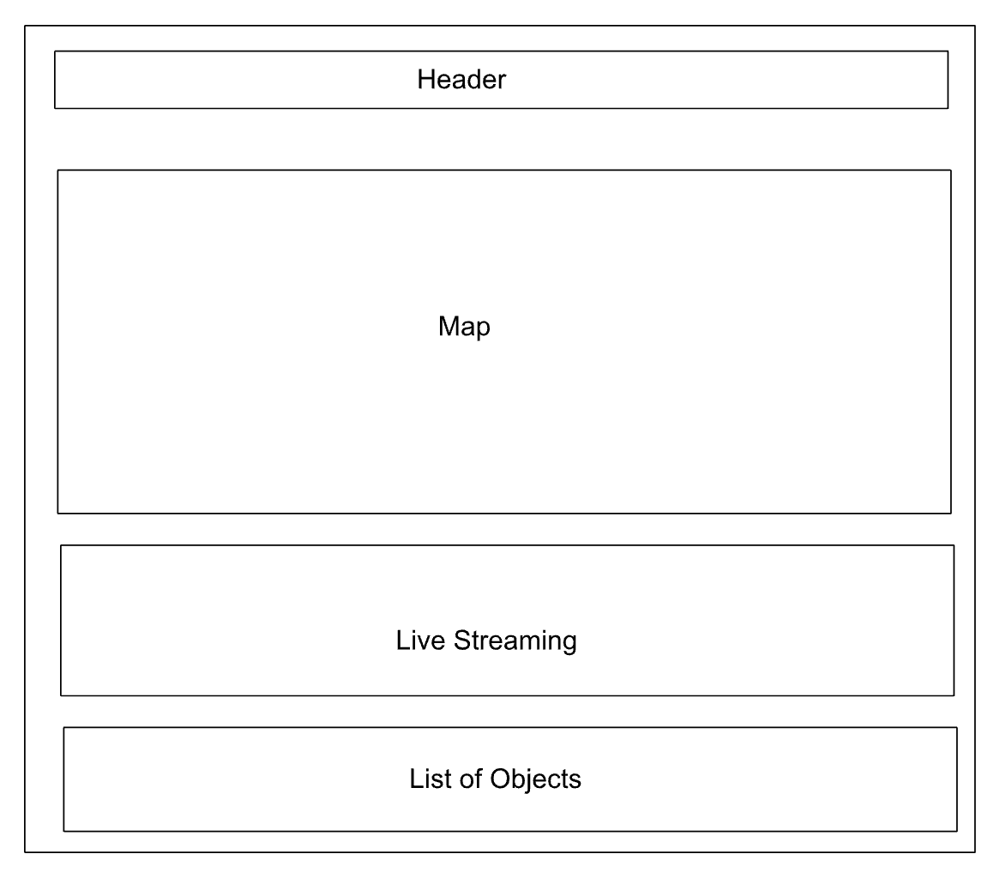

# Project 1

**Title**: Project 1  
**Date**: 20 September 2022  
**Deliverable**: CSS/HTML/JS/API  

For Project 1, I am planning to make a website to get live feed information from the International Space Station. I will be using 2 APIs. The first is "Where is the ISS?" This API will help to track the International Space Station and get necessary information regarding its path. The second one is the NASA NeoWS API. This API will give us information about the Near Earth Objects. Additionally, I will add a livestream video from ISS to the website. There will be a few user interactions, like tracking the ISS. I am planning to make an interactive map using MAPBOX GL. I am further planning to add another API to display the weather information on the map. Till now, I haven’t decided on using P5.JS.

### WireFrame 

For the project I have created one wireframe.

---

### Process & Insights

So far, I haven't made much progress on Project 1.    

As I didn’t have any experience with APIs and Mapbox, I spent a lot of time tinkering with the box. Initially, I made the current website just to understand how an API works on a website. I have also learnt how to use the weather APIs with Mapbox. I am still tinkering with the APIs. 
 

[Access the current version here](https://hasiburratul.github.io/connectionslab/Week_3/Project1/)

---